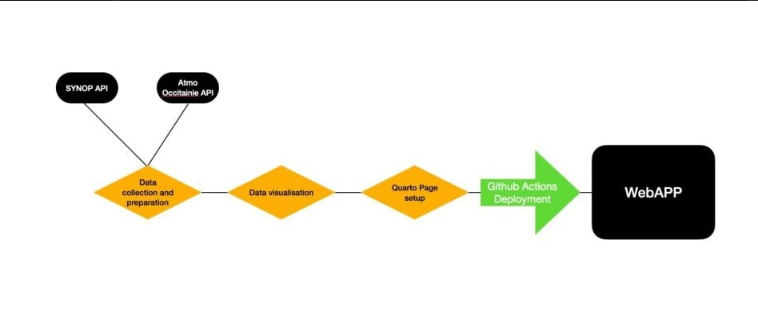
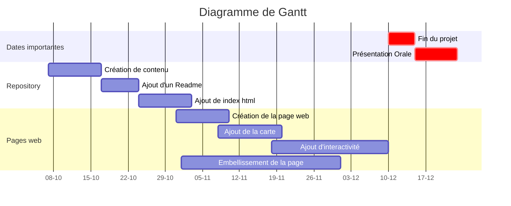

This is the group project, a report on the pollution in Occitanie through two data sets, which are :

* The meteorological prediction  (data **SYNOP**)
* The pollution in Occitanie (data **Atmo Occitanie**)

Objective : create an interactive website giving the pollution of the previous month, the past year and the last five years, for different polluting substances and in a few cities in France.

## Summary of the conditions :  

* At least one page of the website must contain an interactive element (maps, widget, etc.)  

* The code must be placed in a repository /HAX712X

* Make a slideshow (with Quarto) to use during the oral presentation of the project 

* Create a file .gitignore to avoid adding unecessary files 

* Here is the link to the website page : https://romeobex.github.io/Projet_Groupe_Pollution_Air_Occitanie/ 

* A code extract for the website 

* An authors list

* Code at least one class with Python 

* The project must contain submodules

* At least two branches must be used during the project

## Packages/Software description for the project :

**Numpy** : NumPy is very useful for mathematical calculations involving arrays and matrixes. Thanks to this package operations are far more quick and efficient than with Python lists.

**os** : With the os module, operations can be made independently of the operaing system, which simplifies group work, as people can more easily work from different operating systems.  

**pandas** : library specialised in data manipulation and analysis 
The name « Pandas » is a contraction of the term « Panel Data », referring to the datasets including observations during multiple periods. This library was created as an advanced tool for Python analysis.

**Matplotlib** : Matplotlib is a Python library intended for graph representation of data. It can be combined with NumPy and other pyhton libraries.

## Links to the documentation :

* https://paintmaps.com/map-charts/232c/Occitanie-map-chart (carte)
* https://docs.python.org/fr/3.5/tutorial/ (aide python)
* https://support.zendesk.com/hc/fr/articles/4408846544922-Formatage-de-texte-avec-Markdown (text markdown) 

## Choses à faire : 

* Corrélation entre températures et pollutions dans chaque ville
* Possiblités de faire des graphs ? 
* Réussir à ne pas afficher le code dans l'onglet "Carte intéractive"
* Création d'une classe ? laquelle ? 
* Titre du graphe pour les 4 graphes + les expliquer brièvement
* Importation des données avec le site meteo

