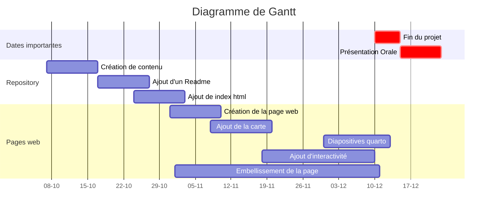

This is the group project, a report on the pollution in Occitanie through two data sets, which are :

* The meteorological prediction  (data **SYNOP**)
* The pollution in Occitanie (data **Atmo Occitanie**)

Objective : create an interactive website giving the pollution of the previous month, the past year and the last five years, for different polluting substances and in a few cities in France.

## Summary of the conditions :  

* At least one page of the website must contain an interactive element (maps, widget, etc.)  

* The code must be placed in a repository /HAX712X

* Make a slideshow (with Quarto) to use during the oral presentation of the project 

* Create a file .gitignore to avoid adding unecessary files 

* Here is the link to the website page : https://romeobex.github.io/Projet_Groupe_Pollution_Air_Occitanie/ 

* A code extract for the website 

* An authors list

* Code at least one class with Python 

* The project must contain submodules

* At least two branches must be used during the project

## Links to the documentation :

* https://paintmaps.com/map-charts/232c/Occitanie-map-chart (carte)
* https://docs.python.org/fr/3.5/tutorial/ (aide python)
* https://support.zendesk.com/hc/fr/articles/4408846544922-Formatage-de-texte-avec-Markdown (text markdown) 

